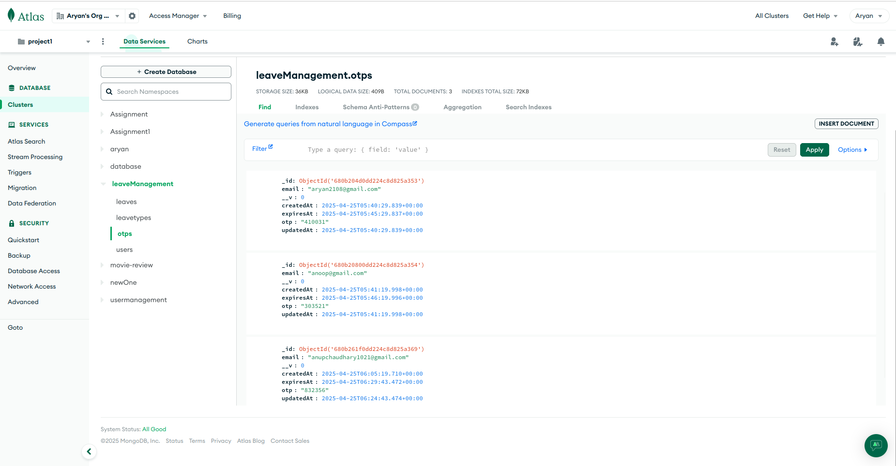

# Leave Management API

A robust backend REST API for leave management with user authentication, built with NestJS and MongoDB.

## Features

- **User Management**

  - User registration with email verification
  - Authentication with JWT
  - Password reset with OTP
  - Profile management

- **Leave Management**

  - Apply for leaves with different types
  - View leave history
  - Track leave balance
  - Email notifications

- **Security**
  - Password hashing with bcrypt
  - JWT authentication
  - Input validation
  - Error handling

## API Endpoints

### User Management

- `POST /api/v1/users/signup` - Create a new user account
- `POST /api/v1/auth/login` - Authenticate user and return token
- `POST /api/v1/users/forget-password` - Trigger password reset process
- `POST /api/v1/users/send-otp` - Resend OTP for verification
- `POST /api/v1/users/verify-otp` - Verify OTP sent to user
- `GET /api/v1/users/profile` - Retrieve user profile details
- `PATCH /api/v1/users/profile` - Update user profile

### Leave Management

- `POST /api/v1/leave` - Apply for a leave
- `GET /api/v1/leave` - Get all leaves with pagination and filtering
- `GET /api/v1/leave/:leaveId` - Get details of a specific leave
- `GET /api/v1/leave/types` - Get all leave types

## Getting Started

### Prerequisites

- Node.js (v14 or higher)
- MongoDB

### Installation

1. Clone the repository
2. Install dependencies

```bash
npm install
```

3. Set up environment variables (see `.env.example`)
4. Run database seed

```bash
npm run seed
```

5. Start the server

```bash
npm run start:dev
```

## Business Rules

- Each new user is automatically initialized with 6 total leaves
- Users cannot apply for more than 1 leave on the same day
- Backdated leave applications older than 3 days are not allowed
- OTP expires in 5 minutes from the time of generation




